# Zoey App - Interactive Images for Shopify

A Shopify app that lets merchants add interactive SVG images to their online stores. Merchants create interactive images in [Interactive Studio](https://interactivity.studio/), then easily place them anywhere on their storefront using the Shopify theme editor.

---

## Table of Contents

**📐 Design & Architecture**
- [What is This App?](#what-is-this-app)
- [System Overview](#system-overview)
- [Key Concepts](#key-concepts)
- [Theme Editor Architecture](#theme-editor-architecture)

**👥 User Experience**
- [User Flows](#user-flows)
- [Two User Experiences, Two Access Paths](#two-user-experiences-two-access-paths)

**💻 Development**
- [Getting Started](#getting-started)
- [Development Commands](#development-commands)
- [Project Structure](#project-structure)
- [Deploy to Production](#deploy-to-production)

**📚 Resources**
- [Shopify Resources](#shopify-resources)
- [External Services](#external-services)

---

## 📐 Design & Architecture

### What is This App?

**The Problem**: Merchants want to add engaging, interactive images (hotspots, hover effects, clickable regions) to their Shopify stores, but Shopify doesn't natively support this.

**The Solution**: This app bridges [Interactive Studio](https://interactivity.studio/) (where merchants create interactive images) with Shopify (where merchants display them). Once connected, merchants can:

1. Create interactive images in Interactive Studio
2. Sync those images to their Shopify store
3. Place images anywhere on their storefront using the theme editor

---

### System Overview

The app connects three systems to deliver interactive images to Shopify storefronts:

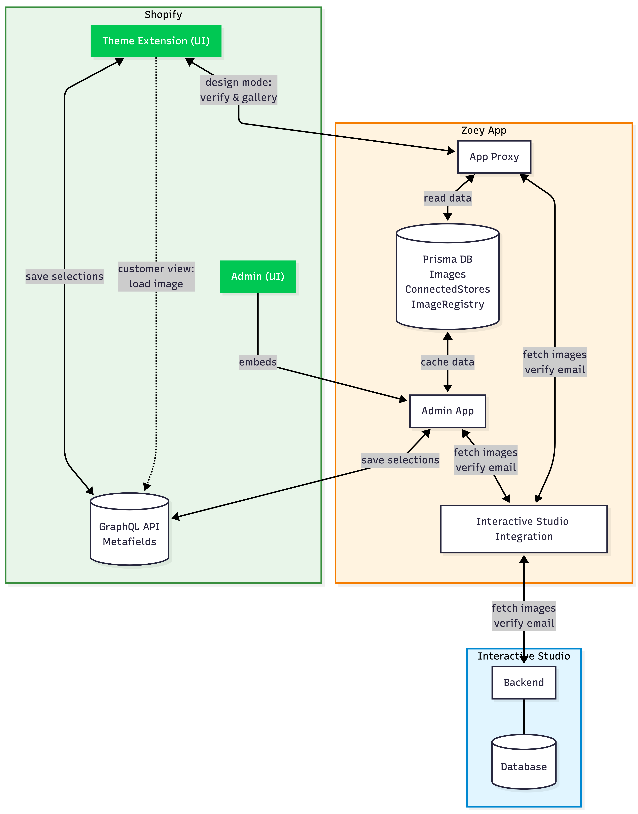

**Three Core Components:**

1. **Interactive Studio** - External platform where merchants design interactive SVG images with hotspots, hover effects, and animations

2. **Zoey App** - This Shopify app that:
   - Verifies and registers merchant ownership of both Shopify and Interactive Studio accounts
   - Syncs and caches images from Interactive Studio to local database
   - Provides image selection UI in the theme editor
   - Serves SVG content to the storefront via App Proxy

3. **Shopify Storefront** - Where customers see the interactive images:
   - Theme extension provides the SVG Selector block
   - Merchants place blocks anywhere in their theme
   - Customers experience full image interactivity

**Data Flow Behind the Scenes:**
- **Connection**: `ConnectedStores` table links Shopify store ID to verified Interactive Studio email
- **Image Sync**: SVG content and metadata stored in `Image` table for fast retrieval
- **Image Placement**: `ImageRegistry` table maps theme block IDs to selected images
- **Content Delivery**: App Proxy securely serves SVG content from database to storefront

> **Note**: The actual implementation simulates Interactive Studio integration without backend access. Image sync and account verification are simulated for demonstration purposes.

---

### Key Concepts

#### Why App Proxy?

Shopify storefronts can't directly call external APIs for security reasons. The [App Proxy](https://shopify.dev/docs/apps/online-store/app-proxies) solves this:

- Shopify provides a URL under the store's domain (e.g., `/apps/zoey/...`)
- Requests to this URL are forwarded to our app with verified shop information
- This lets the storefront fetch image content securely

**Learn more**: [What is a Shopify Application Proxy?](https://medium.com/shop-sheriff/what-is-a-shopify-application-proxy-and-how-can-i-use-it-153bf99d1a9d)

#### Why Theme Extension?

[Theme extensions](https://shopify.dev/docs/apps/build/online-store/theme-app-extensions) let apps add UI to the theme editor without modifying theme code:

- Merchants can add our block like any other theme block
- Works with any theme (no code changes needed)
- Block configuration is saved with the theme

#### Why Local Image Storage?

We cache images locally instead of fetching from Interactive Studio every time:

- **Performance**: Faster load times for customers
- **Reliability**: Store works even if Interactive Studio is temporarily down
- **Control**: Merchants see a snapshot of their images at sync time

#### SVG in HTML

This app uses SVGs extensively for interactive images. For different approaches to embedding SVGs in web pages, check out: [Ways to Use SVG in Your HTML Page](https://claude-e-e.medium.com/ways-to-use-svg-in-your-html-page-dd504660cb37)

---

### Theme Editor Architecture

#### Design Mode State Machine

When a merchant adds the "SVG Selector" block in the theme editor, the block needs to figure out what to show. This happens through a series of checks:

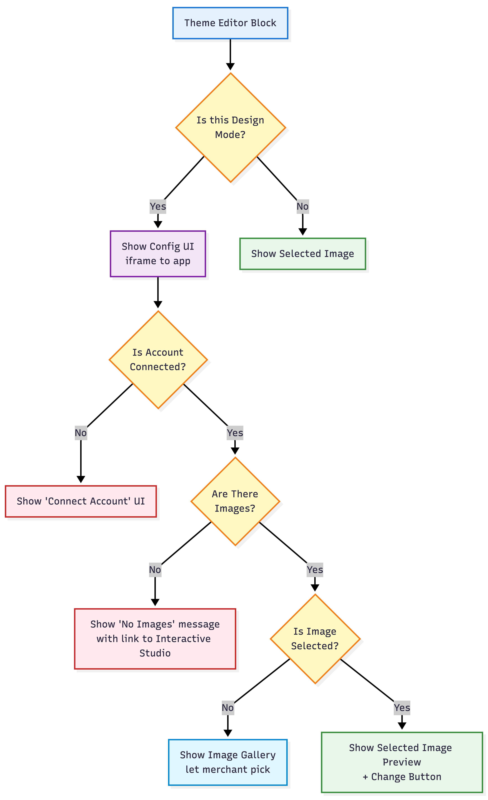

#### How Design Mode Detection Works

Shopify provides multiple ways to detect when merchants are in the theme editor:

- **JavaScript**: `Shopify.designMode` is `true` when in the theme editor
- **Liquid**: `request.design_mode` can be used in template code

See [Shopify's documentation](https://shopify.dev/changelog/detect-the-theme-editor-using-liquid-and-javascript) for more details.

**Important**: All these checks go through App Proxy. Even in the theme editor, the block is technically on the storefront side. Every check (connection status, image list, selected image) calls back to the app via the proxy endpoint.

---

## 👥 User Experience

### User Flows

#### Flow 1: First-Time Setup (Connecting Accounts)

Before using the app, merchants must connect their Interactive Studio account to their Shopify store. This is a one-time setup.

**Why this flow exists**: Interactive Studio is a separate platform with its own user accounts. We need to verify the merchant owns both the Shopify store and the Interactive Studio account.

**Steps**:

1. **Merchant opens the app** in Shopify Admin or adds SVG Selector block in theme editor

2. **Merchant enters their Interactive Studio email**

3. **System sends a verification code** to that email

4. **Merchant enters the code** to prove they own the email
   
**What happens behind the scenes**:
- We store a `ConnectedStores` record linking the Shopify store ID to the verified email
- Interactive Studio uses this email to know which images belong to this store

---

#### Flow 2: Syncing Images from Interactive Studio

Once connected, merchants can bring their interactive images into Shopify.

**Why this flow exists**: Images are created in Interactive Studio, but need to be cached locally in the Shopify app for fast loading and offline availability.

**Steps**:

1. **Merchant navigates to the Interactive Studio page** in the app
   
2. **System automatically fetches images** from Interactive Studio using the connected email

3. **Images appear in the gallery** ready for use
   
**What happens behind the scenes**:
- App calls Interactive Studio API with the verified email
- Receives list of images (SVG content, titles, IDs)
- Stores images locally in the `Image` table for fast retrieval
- Updates existing images if they've changed in Studio

---

#### Flow 3: Placing an Image on the Storefront

This is the core use case - merchants placing interactive images on their store pages.

**Why this flow exists**: Merchants need an easy way to add images to any page without touching code. The Shopify theme editor is the standard way merchants customize their stores.

**Steps**:

1. **Merchant opens the Shopify theme editor** (Online Store > Themes > Customize)

2. **Merchant adds the "SVG Selector" block** to any section
 
3. **The block shows current connection status** and image options

4. **Merchant clicks to browse images** and selects one

5. **Selected image appears in the preview** and saves with the theme


**What happens behind the scenes**:
- The theme block (Liquid) renders an iframe pointing to the app
- The iframe shows the image selector UI (connect prompt or image gallery)
- When merchant selects an image, we save the mapping in `ImageRegistry` and in Shopify for fast access via GraphQL
- The storefront renders the actual SVG content for customers

---

#### Flow 4: Customer Viewing an Interactive Image

When a customer visits the store, they see the interactive images.

**Why this flow exists**: This is the end result - customers experiencing the interactive content. At this point, liquid is obtaining the selected image index from Shopify and image CDN for lowest latency.

**Steps**:

1. **Customer visits a page** with an interactive image

2. **Image loads with full interactivity** (hover effects, clickable regions, animations)

**What happens behind the scenes**:
- Theme block has a `blockId` identifying which image to show
- Block calls Shopify metadata field for getting selected image ID
- Fetch image CDN link
- Customer's browser renders the SVG with embedded JavaScript for interactivity

---

### Two User Experiences, Two Access Paths

The app serves two different audiences with different needs:

| Audience | Where They Are | What They See | How App is Accessed |
|----------|----------------|---------------|--------------------|
| **Store Owner** (Merchant) | Shopify Admin or Theme Editor | Configuration UI, image selection | Direct to App |
| **Shopper** (Customer) | Live Storefront | Interactive images | Via App Proxy |

#### Why Two Paths?

**Store Owner in Admin**: Already authenticated through Shopify's OAuth. The app runs as an embedded iframe inside Shopify Admin, so requests go directly to the app server. Shopify handles authentication and passes shop information securely.

**Shopper on Storefront**: Not authenticated - they're just browsing. The storefront can't call external APIs directly (security restriction). Instead, requests go through Shopify's [App Proxy](https://shopify.dev/docs/apps/online-store/app-proxies), which forwards them to our app with verified shop information.


**Same Database, Different Entry Points**: Both paths access the same data. When a merchant selects an image in the theme editor, that selection is saved to the database. When a shopper views the page, the app proxy reads from the same database to serve the correct image.

---

## 💻 Development

### Getting Started

#### Prerequisites

Before you begin, make sure you have:

- **Node.js** (version 20.10 or higher) - [Download here](https://nodejs.org/)
- **npm** (comes with Node.js)
- **Shopify Partner Account** - [Create a free account](https://partners.shopify.com/signup)
- **Development Store** - [Create one in your Partner Dashboard](https://help.shopify.com/en/partners/dashboard/development-stores#create-a-development-store)
- **Shopify CLI** - [Installation guide](https://shopify.dev/docs/apps/tools/cli/install)

#### Step 1: Create Your Shopify Partner Account

1. Go to [partners.shopify.com](https://partners.shopify.com/signup) and sign up for a free Partner account
2. Once registered, log in to access your [Partner Dashboard](https://partners.shopify.com/)
3. In the Partner Dashboard, create a **development store** for testing:
   - Navigate to **Stores** → **Add store** → **Create development store**
   - Fill in the store details and create your test store

#### Step 2: Set Up the Project Locally

1. **Clone the repository**
   ```bash
   git clone <repository-url>
   cd zoey-app
   ```

2. **Install dependencies**
   ```bash
   npm install
   ```

3. **Install Prisma client** (for database management)
   ```bash
   npm install @prisma/client
   ```

4. **Generate Prisma schema**
   ```bash
   npx prisma generate
   ```

5. **Set up the database**
   ```bash
   npx prisma migrate dev
   ```
   
   > **Note**: Run this command whenever you modify the `schema.prisma` file to update your database schema.

6. **Install Shopify Polaris** (UI components)
   ```bash
   npm install @shopify/polaris
   ```

#### Step 3: Start Development Server

1. **Run the development server**
   ```bash
   shopify app dev
   ```
   
   - Shopify CLI will prompt you to log in to your Partner account
   - Select your Partner organization
   - Choose your development store to install the app
   - The CLI will automatically open your app in the browser

   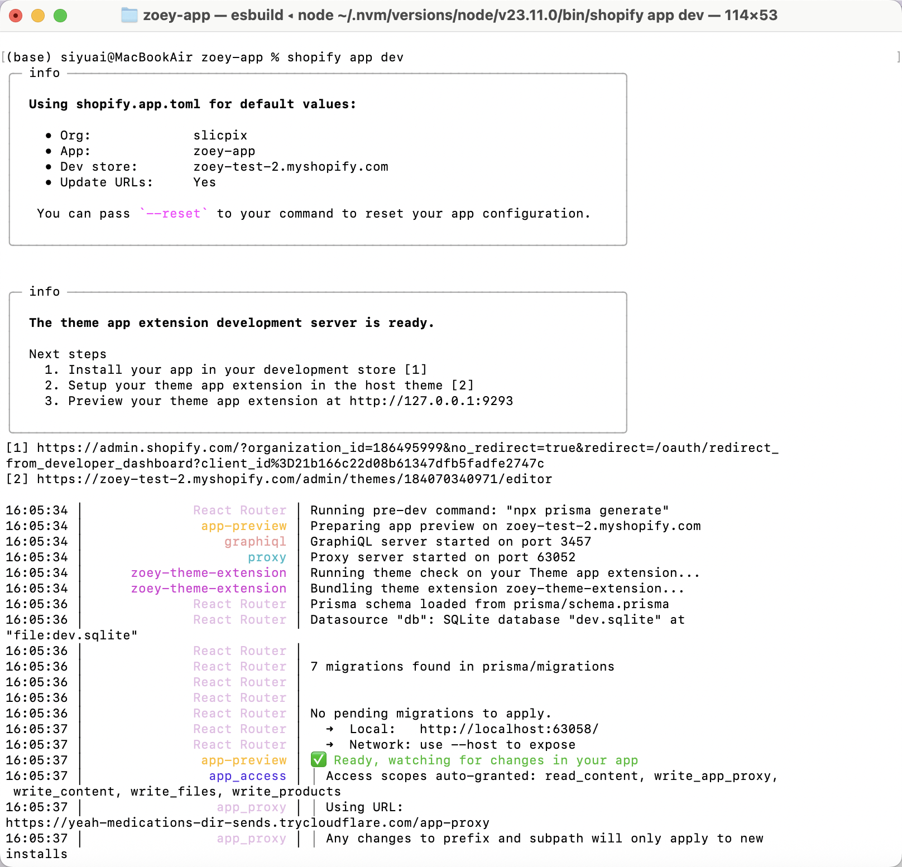
   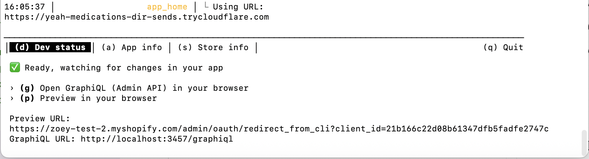

2. **Preview in Chrome** (required for theme extension preview)
   
   The theme extension preview with hot reloading is only available in Google Chrome. Make sure you're using Chrome when testing the app in the theme editor.

3. **Access your app**
   
   After running `shopify app dev`, you can access:
   - **Admin interface**: Press `P` in the terminal or follow the URL shown
   - **Development store admin**: Go to your store admin at `https://admin.shopify.com/store/[your-store]`

   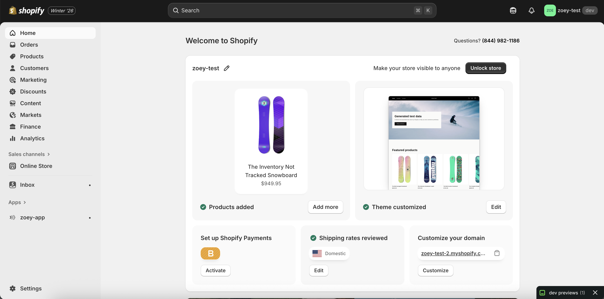

#### Step 4: Testing the Connection Flow

##### Option A: Connect from Admin Page

1. **Open the app in Shopify Admin**
   - In your development store admin, go to **Apps** → **zoey-app** → **Interactive Studio**

2. **Click "Connect Account"**
   
   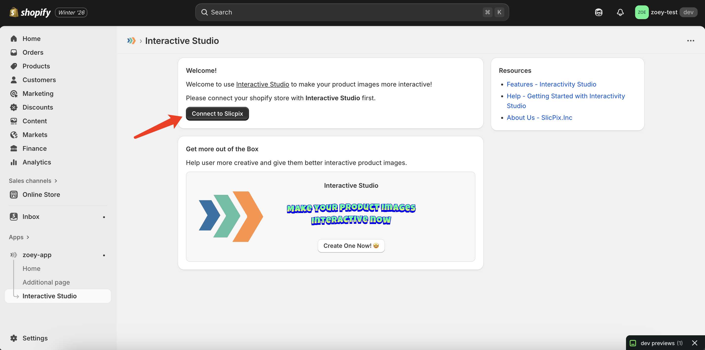

3. **Enter your Interactive Studio email**

4. **Enter the verification code** sent to your email
   
   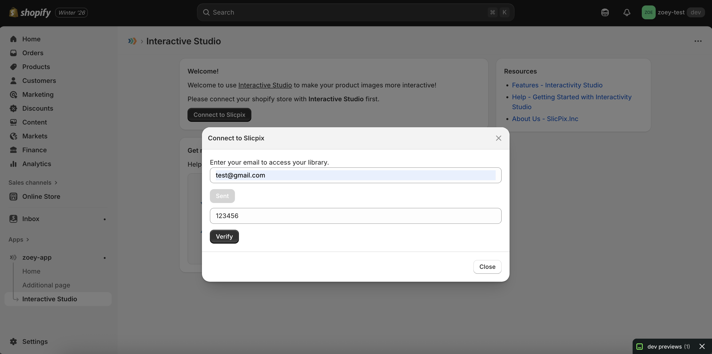

5. **Connection successful!**
   
   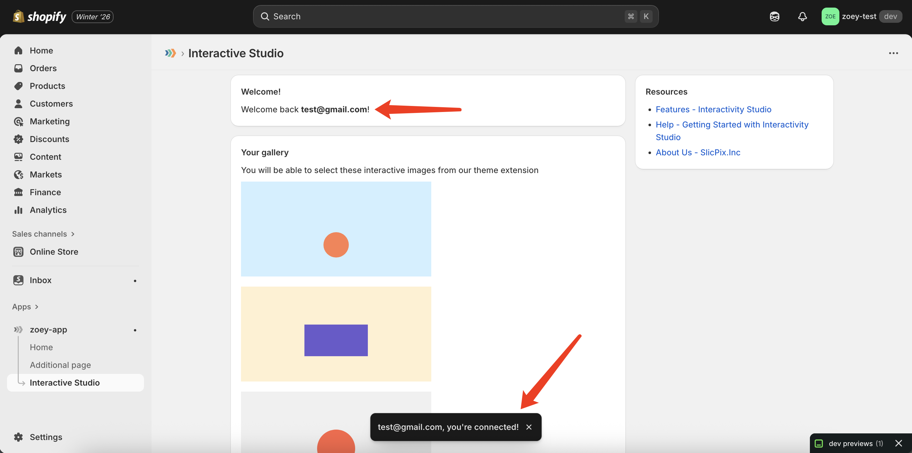

##### Option B: Connect from Storefront (Theme Editor)

1. **Open the Shopify theme editor**
   - In your store admin, go to **Online Store** → **Themes**
   - Click **Edit theme** on your active theme
   
   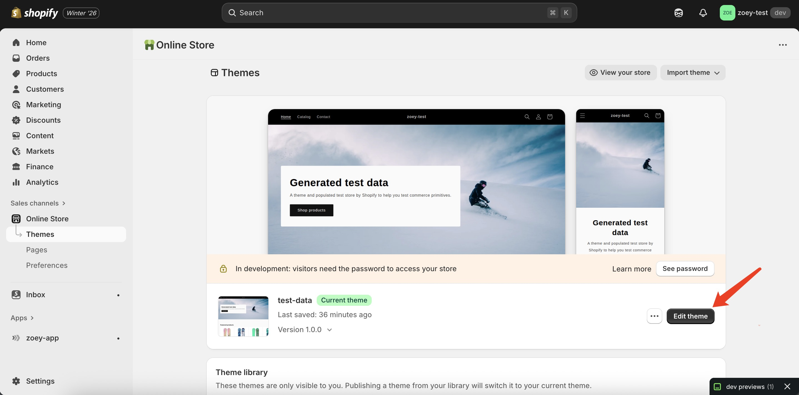

2. **Add the SVG Selector block**
   - Click **Add section** or **Add block** (depending on where you want to place it)
   - Search for **"SVG Selector"** in the Apps picker
   - Add the block to your page
   
   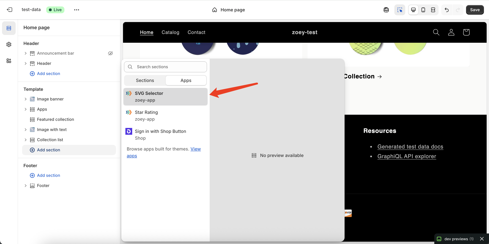

3. **Connect your account directly from the block**
   - If not connected, you'll see a "Connect Account" prompt
   - Follow the same email verification flow
   
   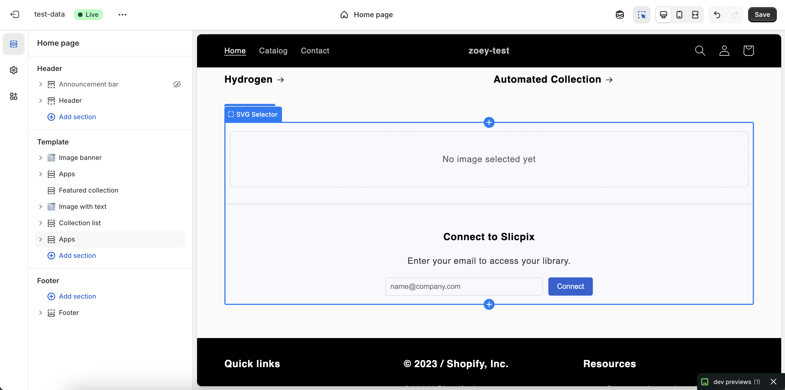

4. **Select an image**
   - Once connected, your Interactive Studio gallery will appear
   - Click on an image to select it
   - The image will appear in the theme editor preview
   
   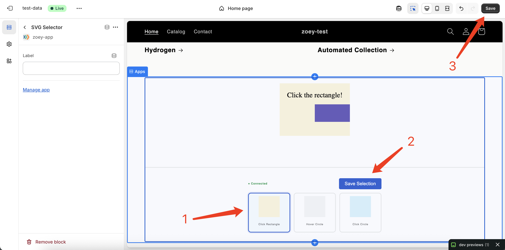

5. **Save your theme** to publish the changes

#### Step 5: View on Live Storefront

1. **Preview your store**
   - Click **Preview** in the theme editor, or
   - Visit your store at `https://[your-store].myshopify.com`

2. **See the interactive image in action**
   - Navigate to the page where you added the SVG Selector block
   - The interactive image will load with full functionality
   - Test hover effects, clickable regions, and animations
   
   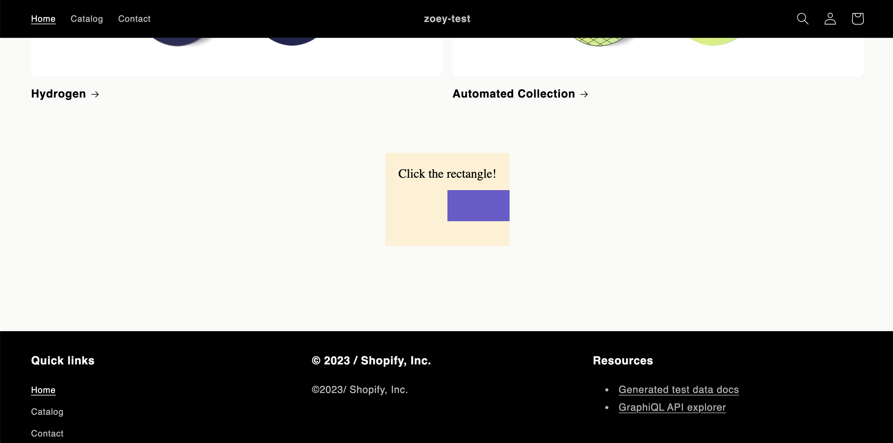

#### Step 6: Testing Disconnection (Optional)

To test the connection flow again or switch accounts:

1. **Access Prisma Studio** (database viewer)
   ```bash
   npx prisma studio
   ```
   
   This will open a browser window at [http://localhost:5555/](http://localhost:5555/)

2. **Delete connection records**
   - Navigate to the `ConnectedStores` model
   - Delete the record for your test store
   - This will disconnect the account
   
   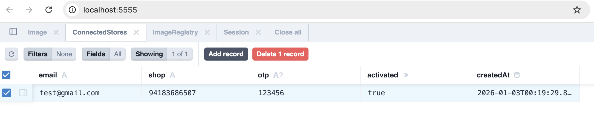

3. **Verify disconnection**
   - Refresh your app in Shopify Admin
   - You should see the "Connect Account" prompt again

#### Troubleshooting

**Issue**: `shopify app dev` fails to start
- **Solution**: Run `shopify app dev clean` to clear the cache, then try again

**Issue**: Database changes not reflected
- **Solution**: Run `npx prisma generate` and `npx prisma migrate dev` after modifying `schema.prisma`

**Issue**: Theme extension not showing in editor
- **Solution**: Make sure you're using Google Chrome and the dev server is running

**Issue**: "Not connected" even after connecting
- **Solution**: Clear your browser cache or try in an incognito window

---

### Development Commands

#### Essential Commands

```bash
# Start development server with hot reloading
shopify app dev

# Clean app cache (useful when troubleshooting)
shopify app dev clean

# Install dependencies
npm install

# Install Prisma client
npm install @prisma/client

# Generate Prisma client after schema changes
npx prisma generate

# Update database schema after modifying schema.prisma
npx prisma migrate dev

# Open Prisma Studio (database GUI)
npx prisma studio

# Install Shopify Polaris UI components
npm install @shopify/polaris

# Deploy to production
npm run deploy
```

#### When to Use Each Command

- **After modifying `schema.prisma`**: Run `npx prisma generate` then `npx prisma migrate dev`
- **When things break unexpectedly**: Try `shopify app dev clean` first
- **To view/edit database**: Use `npx prisma studio` to open the GUI at http://localhost:5555/
- **Before starting work**: Run `shopify app dev` to start the local server

---

### Project Structure

```
zoey-app/
├── app/                    # React Router app code
│   ├── routes/            # API routes and pages
│   ├── components/        # React components
│   └── db.server.ts       # Database connection
├── extensions/            # Theme app extension
│   └── zoey-svg-selector/ # SVG Selector block
│       ├── blocks/        # Liquid block files
│       └── assets/        # JavaScript and CSS
├── prisma/               # Database schema
│   └── schema.prisma     # Prisma data model
└── shopify.app.toml      # App configuration
```

---

### Deploy to Production

When you're ready to deploy your app to production:

1. **Choose a hosting provider** (Railway, Vercel, Heroku, etc.)
2. **Set up environment variables** for your production database
3. **Run the deploy command**
   ```bash
   npm run deploy
   ```

See [Shopify's deployment guide](https://shopify.dev/docs/apps/deployment) for detailed instructions on hosting options and deployment best practices.

---

## 📚 Resources

### Shopify Resources

#### Getting Started
- [Building Shopify Apps](https://shopify.dev/docs/apps/getting-started) - Start here for app development basics
- [App Authentication](https://shopify.dev/docs/apps/auth) - How OAuth works with Shopify
- [Shopify CLI](https://shopify.dev/docs/apps/tools/cli) - Command-line tool for app development

#### Theme App Extensions
- [Theme App Extensions Overview](https://shopify.dev/docs/apps/build/online-store/theme-app-extensions) - Core concept for adding blocks to themes
- [Theme Extension Configuration](https://shopify.dev/docs/apps/build/online-store/theme-app-extensions/configuration#app-blocks-for-themes) - How to configure app blocks
- [App Surfaces](https://shopify.dev/docs/apps/build/app-surfaces) - Where your app can appear in Shopify

#### Storefront Integration
- [App Proxy](https://shopify.dev/docs/apps/online-store/app-proxies) - Secure storefront-to-app communication
- [Liquid Template Language](https://shopify.dev/docs/api/liquid) - Shopify's templating language
- [Dynamic Sources](https://shopify.dev/docs/storefronts/themes/architecture/settings/dynamic-sources) - Connect theme settings to dynamic data
- [Displaying Metafields](https://help.shopify.com/en/manual/custom-data/metafields/displaying-metafields-on-your-online-store) - Show custom data on your storefront

#### APIs
- [Admin REST API](https://shopify.dev/docs/api/admin-rest/latest/resources/shop#get-shop) - Access shop data
- [Storefront API](https://shopify.dev/docs/api/storefront) - Customer-facing data access

#### UI Components
- [Polaris Web Components](https://shopify.dev/docs/api/app-home/polaris-web-components) - Shopify's design system for embedded apps

#### Tools & Dashboards

- [Partner Dashboard](https://partners.shopify.com/) - Manage apps, stores, and settings
- [Store Admin](https://admin.shopify.com/) - Access your development store
- [App Developer Dashboard](https://dev.shopify.com/dashboard/) - View app analytics, change app icon, and manage settings
- [Development Stores](https://help.shopify.com/en/partners/dashboard/development-stores) - Free testing environments

#### Helpful Resources

- [Detect Theme Editor](https://shopify.dev/changelog/detect-the-theme-editor-using-liquid-and-javascript) - Use `request.design_mode` to detect the theme editor
- [Medium: SVG in HTML](https://claude-e-e.medium.com/ways-to-use-svg-in-your-html-page-dd504660cb37) - Different approaches to embedding SVGs
- [Medium: Shopify App Proxy](https://medium.com/shop-sheriff/what-is-a-shopify-application-proxy-and-how-can-i-use-it-153bf99d1a9d) - Deep dive into app proxies

---

### External Services

- [Interactive Studio](https://interactivity.studio/) - Create interactive images
- [SlicPix](https://slicpix.com/) - Interactive Studio's parent platform